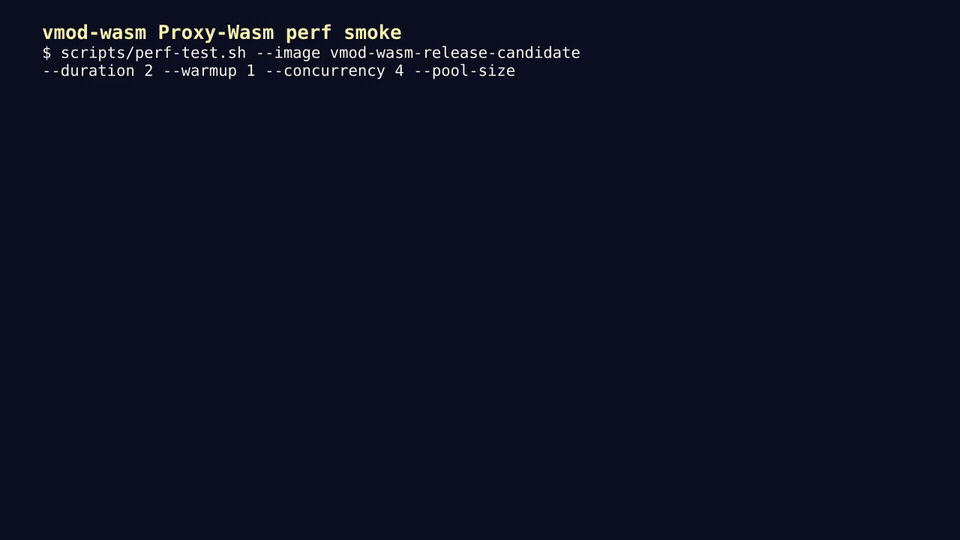

# vmod-wasm

A Varnish VMOD that executes WebAssembly modules for HTTP request processing at the edge.

## Overview

vmod-wasm embeds the [Wasmtime](https://wasmtime.dev/) runtime into Varnish
Cache 9.x. The in-tree examples use Rust compiled to WebAssembly and run from
VCL during request and response processing.

It includes an HTTP-focused
[Proxy-Wasm ABI v0.2.1](https://github.com/proxy-wasm/spec) implementation for
running standard Wasm filters on Varnish, plus a raw host-function path for
small purpose-built modules.

Use it when logic is too reusable or stateful for comfortable VCL, but adding a
separate service hop would be slower or harder to operate.

## Demo



Short `scripts/perf-test.sh` run across baseline proxying, raw Wasm execution,
Proxy-Wasm header callbacks, response-body inspection, and response-body
rewrite. [Watch the MP4](docs/assets/vmod-wasm-perf-demo.mp4).

### Proxy-Wasm Live Validation

This recorded live demo shows the production-style Proxy-Wasm path: VCL loads
an edge-security filter, applies runtime controls, sends real HTTP requests,
and prints guest metrics, host execution stats, and HTTP pool stats.

<video controls src="docs/assets/proxy-wasm-live-validation.mp4" title="Proxy-Wasm live validation demo"></video>

[Watch the MP4](docs/assets/proxy-wasm-live-validation.mp4).

## Features

- Load `.wasm` modules at VCL init time
- Call exported Wasm functions from VCL
- Proxy-Wasm ABI v0.2.1 HTTP filter support: header maps, trailers, buffers,
  HTTP callouts, properties, shared data, metrics, tick timer, and stream
  control
- Deferred `proxy_on_http_call_response` callback, invoked after
  `on_http_request_headers` returns to avoid proxy-wasm SDK re-entrancy
- WASI support (`fd_write`, `clock_time_get`, `random_get` with real implementations)
- Epoch-based execution time limits
- Memory limits (default 16 MiB)
- Optional store pooling for stateless Proxy-Wasm modules
- HTTP connection pooling with circuit breaker for outbound calls
- Streaming response body inspection via VDP
- SSRF prevention (upstream allowlist + IP rebinding protection)
- One Wasmtime engine per loaded VCL for safe VCL reload and discard lifecycles

## Quick Start

These VCL fragments assume an existing backend and installed VMOD. Build the
example modules first and copy the named artifact to the path used by VCL.

```vcl
import wasm;

sub vcl_init {
    wasm.load("my_filter", "/etc/varnish/wasm/test_module.wasm");
    wasm.set_epoch_deadline(100);    # explicit production execution limit
    wasm.set_memory_limit(8388608);  # 8 MiB
}

sub vcl_recv {
    if (wasm.execute("my_filter", "block_bad_bot") != 0) {
        return (synth(403, "Blocked"));
    }
}
```

### Proxy-Wasm

```vcl
import wasm;

sub vcl_init {
    wasm.load("waf", "/etc/varnish/wasm/proxy_wasm_filter.wasm");
    wasm.set_epoch_deadline(100);
    wasm.set_memory_limit(8388608);
}

sub vcl_recv {
    set req.http.X-Wasm-Result = wasm.proxy_wasm_on_request("waf");
    if (req.http.X-Wasm-Result != "0") {
        return (synth(403, "Blocked"));
    }
}

sub vcl_deliver {
    set resp.http.X-Wasm-Action = wasm.proxy_wasm_on_response("waf");
    set resp.filters += "wasm_body";
}
```

## VCL Functions

| Function | Description |
|----------|-------------|
| `wasm.load(name, path)` | Load and compile a .wasm module |
| `wasm.execute(module, func)` | Call an exported function |
| `wasm.version()` | Return vmod-wasm version string |
| `wasm.set_epoch_deadline(ms)` | Max wall-clock time per execution |
| `wasm.get_epoch_deadline()` | Return current deadline |
| `wasm.set_memory_limit(bytes)` | Max Wasm linear memory |
| `wasm.get_memory_limit()` | Return current memory limit |
| `wasm.proxy_wasm_on_request(module)` | Run Proxy-Wasm request lifecycle |
| `wasm.proxy_wasm_on_response(module)` | Run Proxy-Wasm response lifecycle |
| `wasm.proxy_wasm_on_request_configured(module, vm, plugin)` | Request lifecycle with config |
| `wasm.proxy_wasm_on_response_configured(module, vm, plugin)` | Response lifecycle with config |
| `wasm.set_allowed_upstreams(list)` | Upstream allowlist (SSRF prevention) |
| `wasm.set_http_call_limit(limit)` | Max HTTP callouts per request |
| `wasm.set_fail_mode(mode)` | "closed" or "open" on error |
| `wasm.set_store_pool_size(module, size)` | Pre-warmed store count for a module |
| `wasm.set_http_pool_size(size)` | Max persistent HTTP connections |
| `wasm.filter_chain(chain)` | Run a request-side module chain |
| `wasm.filter_chain_response(chain)` | Run a response-side module chain |
| `wasm.get_metrics_json()` | Return Proxy-Wasm metrics as JSON |
| `wasm.get_stats_json()` | Return execution statistics as JSON |
| `wasm.get_pool_stats_json(module)` | Return store pool stats for a module |
| `wasm.get_http_pool_stats_json()` | Return HTTP pool stats |

## Writing Wasm Modules

See [docs/DEVELOPMENT.md](docs/DEVELOPMENT.md) for a complete guide and the
[`examples/`](examples/) directory for focused Rust/Wasm modules. The in-tree
[edge-security-filter](examples/edge-security-filter/) is a reference fixture;
the production edge-security product is maintained in its
[standalone repository](https://github.com/RamazanKara/vmod-wasm-edge-security-filter).

For host function signatures and Proxy-Wasm ABI coverage, see
[docs/COMPATIBILITY.md](docs/COMPATIBILITY.md).

## Building

### Prerequisites

- Varnish Cache 9.x (with varnishapi dev headers)
- Wasmtime C API 49.0.2 (libwasmtime)
- autotools (autoconf, automake, libtool), make, pkg-config, C compiler, Python 3
- Rust with the `wasm32-unknown-unknown` target, clippy and rustfmt for tests/lints
- curl and tar for the pinned companion-filter test fixtures

### Build

```bash
./autogen.sh
./configure --with-wasmtime=/opt/wasmtime
make
make lint check build
make install
```

Run the make targets locally before accepting a change. `make check` runs the
standalone C shared-store tests, Rust configuration tests, and VTC integration
tests. It requires `varnishtest` and downloads pinned companion-filter sources;
Cargo also needs access to any dependencies not already cached.

### Release Bundles

GitHub releases use Varnish-specific tags such as `varnish9-v4.3.5` so the
supported Varnish ABI line is visible before download. The package version
remains semantic (`4.3.5`), while the release channel identifies Varnish 9.

The release workflow packages source and convenience binary bundles for Linux `amd64`
and `arm64` on Varnish 9. Binary bundles include `libvmod_wasm.so`,
`libwasmtime.so`, notices, checksums, and an install note. Source builds remain
the authoritative path for custom Varnish installations.

The package version in this checkout is `4.3.5`, targeting Varnish 9.x. Check a
release's actual assets before relying on a binary bundle being available.

### Docker

```bash
docker build -t vmod-wasm-ci .
docker run --rm vmod-wasm-ci make lint check build
docker run --rm vmod-wasm-ci make distcheck DISTCHECK_CONFIGURE_FLAGS="--with-wasmtime=/opt/wasmtime"
```

For longer lifecycle and reload testing, run `make soak-test`. Logs are written
under `soak-logs/` and include client errors, reload errors, Varnish error logs,
and key `varnishstat` counters.

For a quick local throughput sweep, run `make perf-test`. It compares baseline
Varnish proxying with raw `wasm.execute`, Proxy-Wasm request/response headers,
and response-body inspection/rewrite paths. Logs and NDJSON results are written
under `perf-logs/`.

## Documentation

Use the [Documentation Guide](docs/README.md) as the reading map. The short
version:

- [Production Guide](docs/PRODUCTION.md) — install, constrain, monitor, reload,
  and roll back vmod-wasm safely.
- [Development Guide](docs/DEVELOPMENT.md) — write, build, and test
  Proxy-Wasm modules.
- [Compatibility Matrix](docs/COMPATIBILITY.md) — check ABI coverage before
  porting an existing Proxy-Wasm filter.
- [Configuration Reference](docs/CONFIGURATION.md) — exact `wasm.*` VCL API,
  defaults, return values, and valid scopes.

## License

BSD-2-Clause — see [LICENSE](LICENSE).

## Contributing

Contributions welcome. See [CONTRIBUTING.md](CONTRIBUTING.md) for guidelines.
